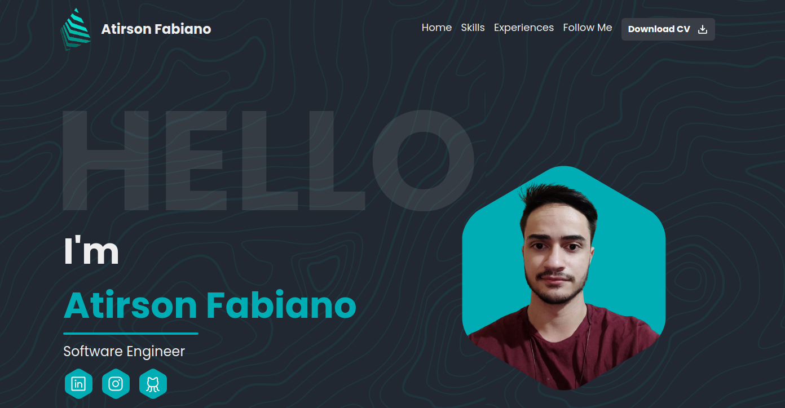
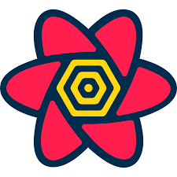

<h1 align='center'>Portfolio with CMS ⚡</h1>



## **Tools 🛠️**

<div align="center">
  <a href="https://reactjs.org/" target="_blank"></a> 
  <a href="https://www.typescriptlang.org/" target="_blank"></a>  
  <a href="https://graphql.org/" target="_blank"></a> 
  <a href="https://hygraph.com/docs/getting-started" target="_blank">
    
  </a>
  <a href="https://tanstack.com/query/v4/docs/react/overview" target="_blank">
    
  </a>
  <a href="https://www.tailwindcss.com/" target="_blank"></a> 
</div>

## **Description 📖**

<h4>The project's use the ReactJS like a library Front-end and using Hygraph to expose a endpoint to get all info about Profile, Skills and Experiences. To get the data I'm using React Query + GraphQL. To styles and custom TailwindCSS.  </h4>
<br />

## **Using 📦**

1. Install Packages

```
yarn install
```

2. Start Project

```
yarn dev
```

Obs: To run everthing right you need create a connection with Hygraph and edit the .env file to set the URL.
